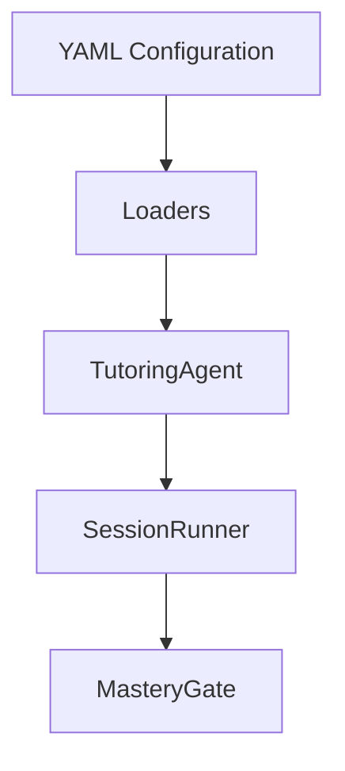

# Capillary Actions Learning Engine (YAML-Driven Tutoring System)

This project implements a configurable AI tutoring system on top of the existing [Capillary Actions SDK](https://github.com/Allogy/capillary-actions-sdk). It uses the following:

- YAML-defined knowledge graphs
- YAML-defined pedagogy policies (Bloom + modality)
- LLM-powered tutoring and assessment

The goal is to create a **portable curriculum execution engine** where the knowledge and teaching strategy is declarative in YAML and not hardcoded in code.

**Status:** Development (0.1.0)

**Requires:** Python >= 3.13, Pydantic >= 2.0

## Architecture

| Layer        | Location | Responsibility           |
| ------------ | -------- | ------------------------ |
| Knowledge    | YAML     | Concepts + prerequisites |
| Pedagogy     | YAML     | Bloom + probing strategy |
| Execution    | Python   | Orchestration            |
| Intelligence | LLM      | Teaching + evaluation    |



### YAML FILES

1. Knowledge Graph (`examples/kg/*.yaml`): Defines the learning structure.

Example fields:

```yaml
id: unique graph ID
name: human-readable name
concepts:
  - id: concept identifier
    name: display name
    prerequisites: [...]
    bloom_level: remember | understand | apply | analyze | evaluate | create
    assessment_modality: recall | explanation | application | project
    mastery_criteria: [...]
```

The purpose is to define what is taught, the dependency structure, and the evaluation targets.

2. Bloom Policy (`examples/policies/bloom.yaml`): Defines how concepts are taught and assessed per cognitive level.

Structure:

```yaml
bloom_levels:
  remember:
    teaching: ...
    probe: ...
```

The purpose is to separate pedagogy from content and allows swapping teaching styles without touching code.

3. Modality Policy (`examples/policies/modality.yaml`): Defines assessment format expectations.

Structure:

```yaml
assessment_modalities:
  recall:
    context: "Short factual answer"
```

The purpose is to control assessment framing and enables switching between recall questions, explanations, applied problems, and project tasks.

### ENGINE COMPONENTS

1. Loader (`src/capillary_actions_sdk/loader.py`)

Loads YAML into typed Python objects such as `KnowledgeGraph`, `KnowledgeConcept`, Bloom policy and Modality policy. The responsibility is converting the declarative config into runtime objects.

2. TutoringAgent (`src/capillary_actions_sdk/tutor.py`)

Handles LLM interactions.

**Methods:**

- `teach()` -> generate explanation
- `probe()` -> generate question
- `score()` -> evaluate response

The key idea is that all pedagogy is injected from YAML policies, so there is no hardcoded teaching logic.

3. MasteryGate (`src/capillary_actions_sdk/tutor.py`)

Determines progression:

- PASS -> unlock next concept
- RETRY -> repeat later
- ESCALATE -> change modality

The purpose is to change raw scores into learning decisions.

4. SessionRunner (`src/capillary_actions_sdk/session_runner.py`)

Orchestrates the full learning flow of

```
teach -> probe -> student answer -> score -> gate -> output
```

The responsibilities are UI logging, execution flow, calling the agent and gate, and returning the structured session result. There is no LLM logic here.

## Learning Flow

A single session works as follows.

1. Teach: The LLM explains concept using Bloom policy
2. Probe: The LLM generates a question based on Bloom level, modality, and mastery criteria.
3. Student Response: The user answers.
4. Score: The LLM evaluates response using rubric criteria.
5. Gate: The system decides if the response PASS, RETRY, or ESCALATE.

## Demo

You can run

```bash
uv run main.py
```

to see a demo of these in practice.

## License

[MIT](LICENSE)
