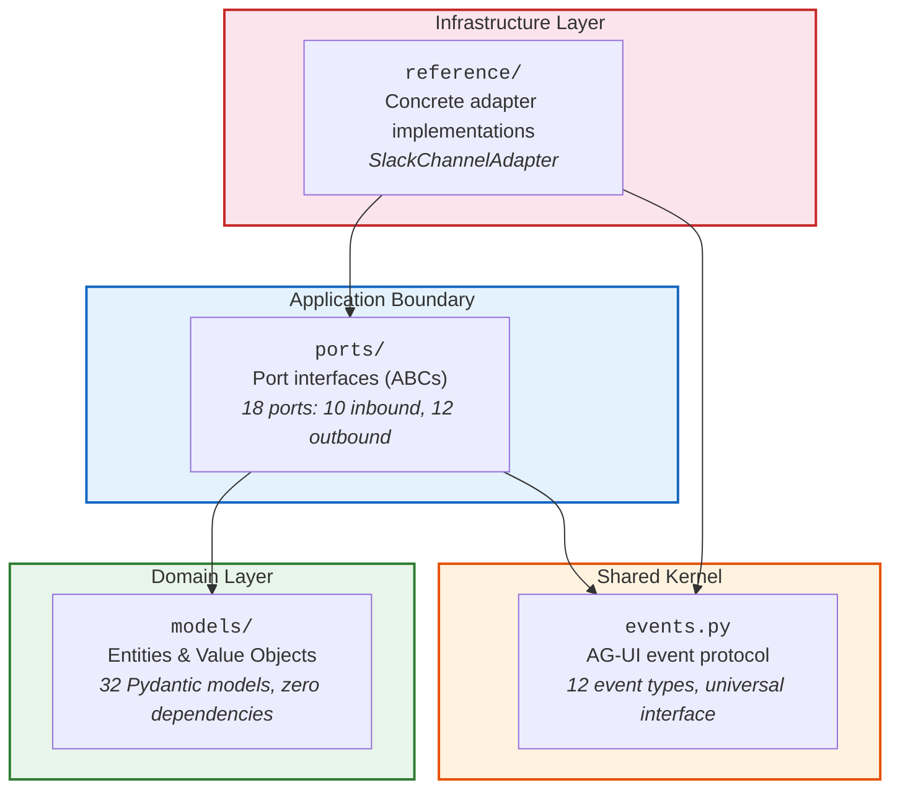
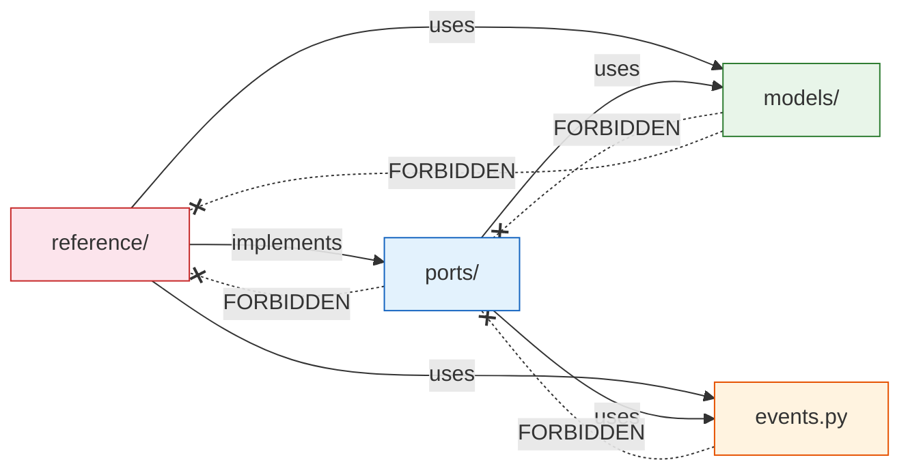
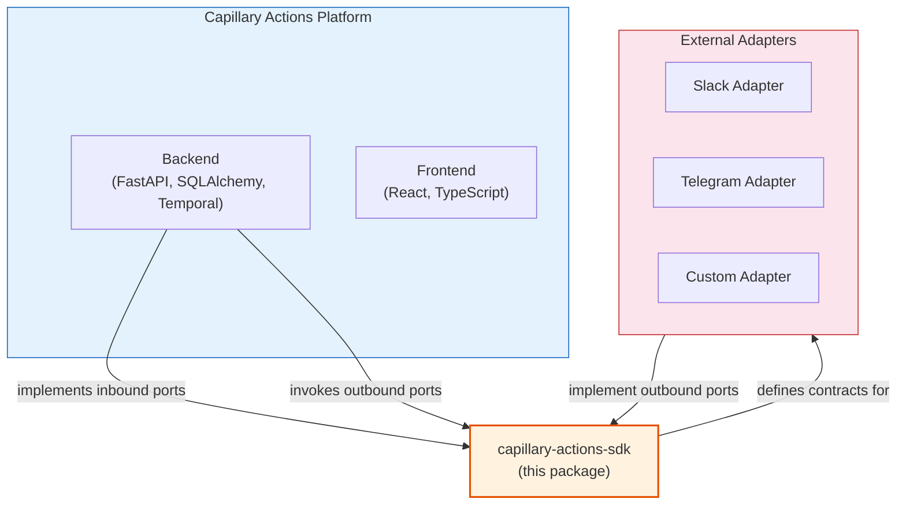

# Architecture Overview

This document explains how the Capillary Actions SDK maps to the [Explicit Architecture](https://herbertograca.com/2017/11/16/explicit-architecture-01-ddd-hexagonal-onion-clean-cqrs-how-i-put-it-all-together/) pattern — a synthesis of Hexagonal (Ports & Adapters), Onion, Clean Architecture, and Domain-Driven Design.

The audience is both **SDK consumers** (developers building adapters and integrations) and **platform contributors** (developers evolving the SDK itself).

## What the SDK Is

The SDK is a **contract library**, not a runtime. It packages:

- **Domain models** — pure Pydantic data structures representing the platform's ubiquitous language
- **Port interfaces** — abstract contracts (Python ABCs) defining what the platform can do and what it needs
- **An event protocol** — the AG-UI Shared Kernel that all adapters speak
- **A reference adapter** — a concrete implementation demonstrating how to build against the contracts

The only runtime dependency is `pydantic >= 2.0.0`. No frameworks, no infrastructure libraries, no database drivers. This is by design — the SDK defines the *shape* of the system, not the *machinery*.

## Concentric Layer Model

The SDK's folder structure maps directly to the concentric layers of Explicit Architecture:

| Layer | Folder | Contains | Depends On |
|-------|--------|----------|------------|
| **Domain** (innermost) | `models/` | Entities, Value Objects — pure data contracts | `stdlib`, `pydantic` only |
| **Application Boundary** | `ports/` | Inbound & Outbound port ABCs | `models/`, `events.py` |
| **Shared Kernel** | `events.py` | AG-UI event protocol (12 types) | `stdlib`, `pydantic` only |
| **Infrastructure** (outermost) | `reference/` | Concrete adapter implementations | `ports/`, `models/`, `events.py` |

## The Dependency Rule

Dependencies always point **inward** — toward the domain. The domain depends on nothing; infrastructure depends on everything.

**Solid arrows** = allowed imports. **Dotted arrows** = forbidden. No arrow ever points inward.

This rule is what makes the SDK extensible: you can swap any adapter without touching the domain models, and you can add new ports without modifying existing infrastructure.

## Port Direction Taxonomy

Ports sit at the application boundary. They come in two flavors, following the Hexagonal Architecture convention:

| Direction | Also Called | Who Implements | Who Invokes | Purpose |
|-----------|-----------|----------------|-------------|---------|
| **Inbound** | Primary / Driving | The **platform** | Adapters call these | "What the platform can do" — start workflows, ingest signals, manage cohorts |
| **Outbound** | Secondary / Driven | **Adapter developers** | The platform calls these | "What the platform needs" — clustering algorithms, scheduling engines, channel bridges |

```mermaid
graph LR
    subgraph left["Driving Side (Inbound)"]
        direction TB
        L1["RunWorkflowPort"]
        L2["ResumeWorkflowPort"]
        L3["IngestSignalPort"]
        L4["ManageCohortPort"]
        L5["RegisterTriggerPort"]
        L6["RunOrchestratorPort"]
    end

    subgraph center["Application Core"]
        direction TB
        C1["Domain Models"]
        C2["AG-UI Events"]
    end

    subgraph right["Driven Side (Outbound)"]
        direction TB
        R1["CohortStrategyPort"]
        R2["TriggerSchedulerPort"]
        R3["ChannelAdapterPort"]
        R4["KnowledgeGraphPort"]
        R5["LearnerProgressPort"]
        R6["TeachingPort"]
    end

    left -->|"adapters invoke"| center
    center -->|"platform invokes"| right

    style left fill:#e3f2fd,stroke:#1565c0
    style center fill:#e8f5e9,stroke:#2e7d32
    style right fill:#fce4ec,stroke:#c62828
```

If you are **building an adapter** (Slack bot, Telegram integration, custom scheduler), you implement **outbound ports**.

If you are **consuming platform capabilities** from an adapter, you call **inbound ports**.

See [ports.md](ports.md) for the complete port catalog.

## Four Domain Tracks

The SDK organizes its models and ports into four domain tracks, each representing a bounded context of the Capillary Actions platform:

| Track | Domain | Models File | Ports File | Focus |
|-------|--------|-------------|------------|-------|
| **1** | Student Model | `models/student_model.py` | `ports/student_model.py` | Cohort-based preference aggregation and learner memory |
| **2a** | Learning Actions | `models/learning_actions.py` | `ports/learning_actions.py` | Triggers, orchestration DAGs, autonomous agent loops |
| **2b** | Learner Interaction | `models/learner_interaction.py` | `ports/learner_interaction.py` | Knowledge graphs, learner progress, teaching context |
| **3** | Presentation | `models/presentation.py` | `ports/presentation.py` | Multi-channel messaging, sessions, human-in-the-loop gates |
| — | Platform Services | — | `ports/platform.py` | Workflow execution, event streaming, state management |

Each track has its own models (domain layer) and ports (application boundary). The tracks communicate through the AG-UI event protocol (Shared Kernel), not through direct imports of each other's models.

## How the SDK Fits in the Platform

The SDK is a **git submodule** of the main Capillary Actions platform repository. It is extracted so that adapter developers never need access to platform internals:

The platform's backend implements the inbound ports (workflow execution, state management) and invokes outbound ports (channel adapters, clustering strategies). External developers only depend on the SDK — they never import from the platform's internal modules.

For the full architecture principles guiding the platform, see the backend's `ARCHITECTURE_PRINCIPLES.md`.

## Further Reading

| Document | What It Covers |
|----------|---------------|
| [Domain Models](domain-models.md) | Entity/Value Object classification, the four tracks, model relationships |
| [Ports](ports.md) | Inbound/outbound port catalog, extension points, method patterns |
| [Events](events.md) | AG-UI Shared Kernel, event taxonomy, lifecycle sequence |
| [Reference Adapters](reference-adapters.md) | SlackChannelAdapter dissected, building your own adapter |
| [Contributing](contributing.md) | Dependency rule enforcement, checklists, testing patterns |
