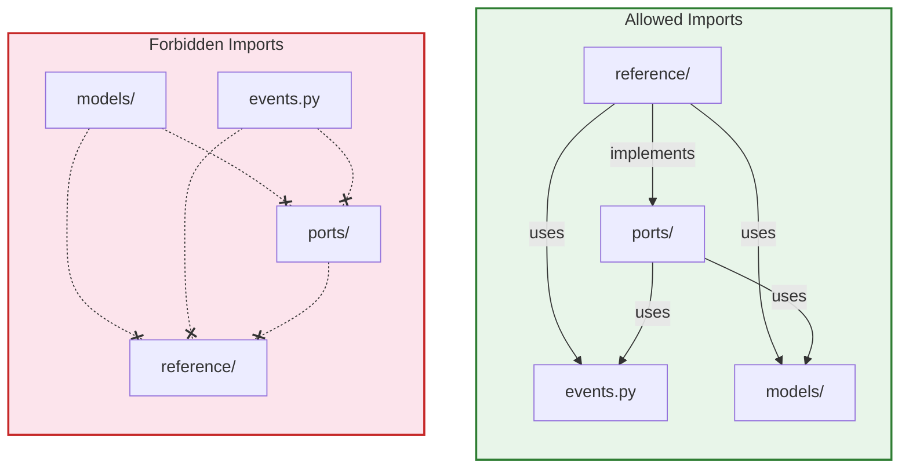
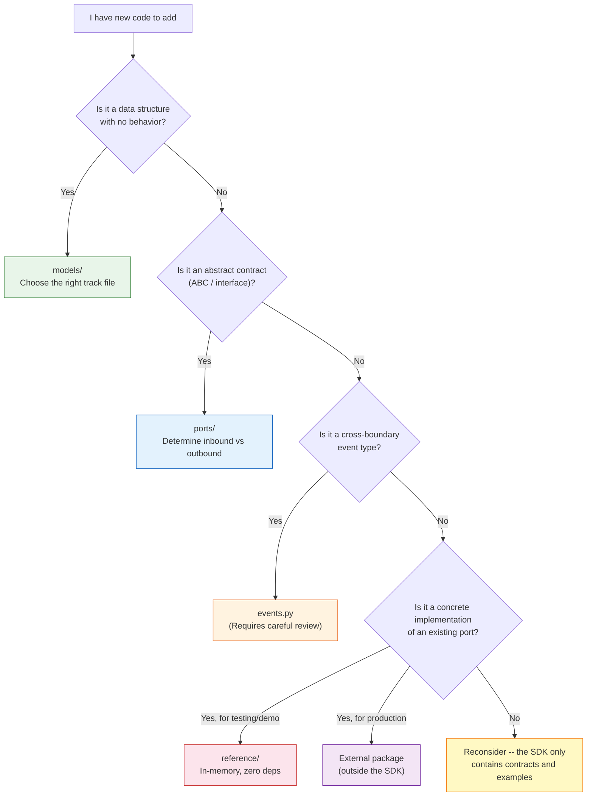

# Contributing -- Architectural Guardrails

> Part of the [Capillary Actions SDK Architecture](architecture.md). This document provides actionable rules and checklists for anyone adding or modifying SDK code.

---

## The Dependency Rule

The single most important rule in the SDK. All imports point **inward** -- toward the domain. No inner layer ever imports from an outer layer.



**Quick reference:**

| Module | Can Import From | Cannot Import From |
|--------|----------------|-------------------|
| `models/` | `stdlib`, `pydantic` | `ports/`, `events.py`, `reference/` |
| `events.py` | `stdlib`, `pydantic` | `models/`, `ports/`, `reference/` |
| `ports/` | `models/`, `events.py`, `stdlib`, `pydantic` | `reference/` |
| `reference/` | `ports/`, `models/`, `events.py`, `stdlib`, `pydantic` | (no restrictions) |

## Decision Tree: Where Does My Code Go?



## Checklists

### Adding a New Model

1. Identify which track it belongs to (Student Model, Learning Actions, Learner Interaction, or Presentation)
2. Create the Pydantic `BaseModel` class in the appropriate track file under `models/`
3. Classify as Entity (has `id: UUID`, lifecycle) or Value Object (defined by attributes)
4. Type-annotate all public fields
5. Use `Field(default_factory=...)` for mutable defaults (lists, dicts, datetimes)
6. Add the model to the re-exports in `models/__init__.py` and its `__all__` list
7. Write tests in `tests/test_models_<track>.py` covering instantiation, defaults, and validation
8. Verify: `from capillary_actions_sdk.models import YourModel` works

### Adding a New Port

1. Determine direction:
   - **Inbound** -- "what the platform can do" (platform implements, adapters invoke)
   - **Outbound** -- "what the platform needs" (adapter developers implement, platform invokes)
2. Identify which domain file it belongs to (`platform.py`, `student_model.py`, `learning_actions.py`, `learner_interaction.py`, or `presentation.py`)
3. Create the ABC class inheriting from `ABC`
4. Define all methods as `async` and mark them `@abstractmethod`
5. Use only SDK types (models, events) and stdlib types in method signatures
6. Add to the re-exports in `ports/__init__.py` with clear inbound/outbound grouping and its `__all__` list
7. Write conformance tests in `tests/test_ports_<domain>.py`:
   - Verify ABC cannot be instantiated directly (`TypeError`)
   - Create a minimal concrete subclass, verify it instantiates
   - Verify `isinstance` check passes
8. Follow the naming convention: `<Action><Domain>Port` (e.g., `IngestSignalPort`, `RunOrchestratorPort`)

### Adding a New Event Type

**This is a breaking change for all adapters.** Proceed with caution.

1. Add a new value to the `AGUIEventType` enum in `events.py`
2. Create a new subclass of `AGUIEvent` with `event_type` defaulting to the new enum value
3. Override `to_dict()` to include subclass-specific fields
4. Ensure `to_dict()` returns a JSON-safe dict (no custom objects, no bytes)
5. Add tests in `tests/test_events.py` covering: instantiation, default values, `to_dict()` serialization
6. Follow the naming convention: `<Category><Action>Event` (e.g., `TextMessageStartEvent`, `ToolCallEndEvent`)
7. Update the event count in documentation if applicable

### Adding a Reference Adapter

1. Choose which outbound port to implement
2. Create a new file in `reference/` (e.g., `reference/telegram_adapter.py`)
3. Subclass the port ABC and implement all abstract methods
4. Use in-memory state only -- no external API calls, no network dependencies
5. Keep zero dependencies beyond `pydantic`
6. Export in `reference/__init__.py`
7. Write tests in `tests/test_reference_<name>.py`:
   - Port compliance (`isinstance` check)
   - Behavioral tests through the port interface
   - Follow the patterns in `test_reference_slack.py`

## Testing Patterns

The SDK uses three distinct test categories:

### Model Validation Tests (`tests/test_models_*.py`)

Test Pydantic field contracts -- instantiation, defaults, type coercion, required fields.

```python
def test_cohort_creation():
    cohort = Cohort(
        id=uuid4(), org_id=uuid4(), name="Test",
        description="A cohort", strategy_type="similarity",
    )
    assert cohort.name == "Test"
    assert cohort.member_ids == set()
    assert isinstance(cohort.state_version, int)
```

### Port Conformance Tests (`tests/test_ports_*.py`)

Verify that ABCs enforce their contracts and that concrete subclasses satisfy them.

```python
def test_channel_adapter_port_is_abstract():
    with pytest.raises(TypeError):
        ChannelAdapterPort()  # Cannot instantiate ABC

def test_concrete_adapter_satisfies_port():
    adapter = SlackChannelAdapter(bot_token="xoxb-test", signing_secret="secret")
    assert isinstance(adapter, ChannelAdapterPort)
```

### Reference Adapter Tests (`tests/test_reference_*.py`)

End-to-end behavior verification through the port interface. Test the adapter's logic, not the external platform.

```python
async def test_token_buffering():
    adapter = SlackChannelAdapter(bot_token="xoxb-test", signing_secret="secret")
    session = make_session()

    await adapter.send_event(TextMessageStartEvent(...), session)
    await adapter.send_event(TextMessageContentEvent(content="Hello "), session)
    await adapter.send_event(TextMessageContentEvent(content="world"), session)
    await adapter.send_event(TextMessageEndEvent(...), session)

    assert adapter._outbox[-1]["text"] == "Hello world"
```

## Code Standards

| Setting | Value | Source |
|---------|-------|--------|
| Linter / Formatter | Ruff | `pyproject.toml` |
| Line length | 100 characters | `pyproject.toml [tool.ruff]` |
| Python target | 3.13 | `pyproject.toml [tool.ruff]` |
| Ruff rules | E, F, I, W | `pyproject.toml [tool.ruff.lint]` |
| Type annotations | Required on all public methods | Convention |
| PEP 561 | `py.typed` marker present | `src/capillary_actions_sdk/py.typed` |
| Runtime dependencies | `pydantic >= 2.0.0` only | `pyproject.toml [project.dependencies]` |
| Dev dependencies | `pytest`, `pytest-asyncio`, `ruff` | `pyproject.toml [dependency-groups]` |
| All port methods | `async` | Convention |

### Running Checks

```bash
uv run ruff check .          # Lint
uv run ruff format .         # Format
uv run pytest                # Run all 209 tests
uv run pytest tests/test_models_student.py  # Run one file
```

## See Also

- [Architecture](architecture.md) -- the big picture and dependency rule
- [Domain Models](domain-models.md) -- what goes in `models/`
- [Ports](ports.md) -- what goes in `ports/`
- [Events](events.md) -- what goes in `events.py`
- [Reference Adapters](reference-adapters.md) -- what goes in `reference/`
