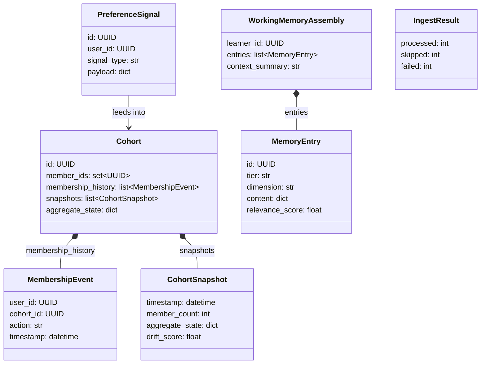
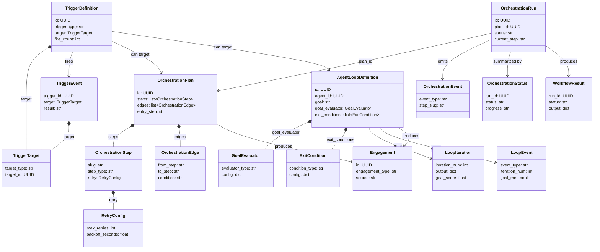
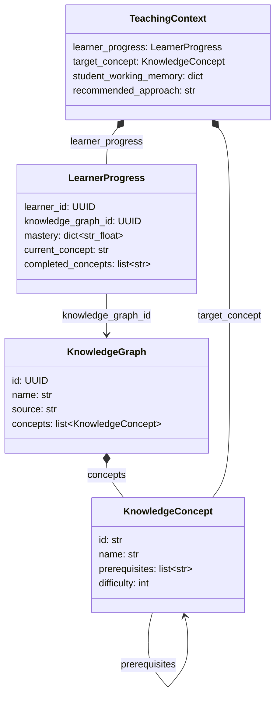
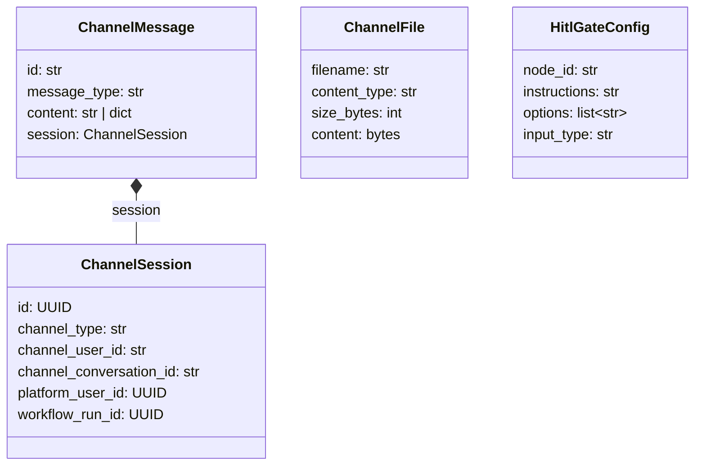

# Domain Models

> Back to [Architecture Overview](architecture.md)

The `models/` package defines the **Domain Layer** of the Capillary Actions SDK. This is the innermost layer in the [Explicit Architecture](architecture.md) (Hexagonal + Clean Architecture + DDD), following the principles described by Herberto Graca: the domain layer contains entities and value objects, and depends on nothing external. All models in this layer import only from the standard library and Pydantic -- never from `ports/`, `events.py`, or `reference/`.

These models form the SDK's **ubiquitous language** -- the shared vocabulary that platform code and adapter implementations both speak.

---

## 1. Architectural Role

- **Innermost layer**: Domain models sit at the center of the architecture. They have zero outward dependencies -- only `stdlib` and `pydantic`.
- **Ubiquitous language**: Every model name and field is a term shared across the platform API, channel adapters, and workflow engine. Changing a model name is a vocabulary change, not just a refactor.
- **Strict isolation**: No model file may import from `ports/`, `events.py`, or `reference/`. This constraint keeps the domain layer portable and testable without infrastructure.
- **Entities and Value Objects**: Following DDD conventions, the domain layer contains two kinds of types -- Entities (with identity and lifecycle) and Value Objects (immutable data carriers defined solely by their attributes).

---

## 2. Entity vs Value Object Classification

| Model | Type | File | Description |
|---|---|---|---|
| `PreferenceSignal` | Entity | `student_model.py` | A timestamped preference signal emitted by a learner. |
| `MembershipEvent` | Value Object | `student_model.py` | Records a learner joining or leaving a cohort. |
| `CohortSnapshot` | Value Object | `student_model.py` | Point-in-time snapshot of a cohort's aggregate state. |
| `Cohort` | Entity | `student_model.py` | A named group of learners with evolving aggregate state. |
| `IngestResult` | Value Object | `student_model.py` | Summary counts from a batch ingest operation. |
| `MemoryEntry` | Entity | `student_model.py` | A single memory entry in any tier (short-term, long-term, working). |
| `WorkingMemoryAssembly` | Value Object | `student_model.py` | Assembled working memory combining short-term and relevant long-term entries. |
| `TriggerTarget` | Value Object | `learning_actions.py` | Specifies what a trigger fires at (type, ID, and initial input). |
| `TriggerDefinition` | Entity | `learning_actions.py` | A configured trigger with type, config, and firing history. |
| `TriggerEvent` | Value Object | `learning_actions.py` | Record of a single trigger firing. |
| `RetryConfig` | Value Object | `learning_actions.py` | Retry policy for an orchestration step. |
| `OrchestrationStep` | Value Object | `learning_actions.py` | A single step in an orchestration DAG. |
| `OrchestrationEdge` | Value Object | `learning_actions.py` | A directed edge between two orchestration steps, optionally conditional. |
| `OrchestrationPlan` | Entity | `learning_actions.py` | A complete orchestration DAG with steps, edges, and error strategy. |
| `OrchestrationEvent` | Value Object | `learning_actions.py` | An event emitted during orchestration execution. |
| `OrchestrationRun` | Entity | `learning_actions.py` | A running instance of an orchestration plan. |
| `OrchestrationStatus` | Value Object | `learning_actions.py` | Lightweight status summary of a running orchestration. |
| `WorkflowResult` | Value Object | `learning_actions.py` | Final result of a completed workflow run. |
| `GoalEvaluator` | Value Object | `learning_actions.py` | Configuration for evaluating whether an agent loop's goal is met. |
| `ExitCondition` | Value Object | `learning_actions.py` | A condition that terminates an agent loop. |
| `AgentLoopDefinition` | Entity | `learning_actions.py` | Definition of an autonomous agent loop with goal, reflection, and exit criteria. |
| `LoopEvent` | Value Object | `learning_actions.py` | An event emitted during agent loop execution. |
| `LoopIteration` | Value Object | `learning_actions.py` | Record of a single iteration within an agent loop. |
| `Engagement` | Entity | `learning_actions.py` | A discrete learning experience -- the output of the Learning Actions system. |
| `KnowledgeConcept` | Value Object | `learner_interaction.py` | A node in the Knowledge Graph representing a teachable concept. |
| `KnowledgeGraph` | Entity | `learner_interaction.py` | A structured representation of a course or curriculum. |
| `LearnerProgress` | Value Object | `learner_interaction.py` | Tracks a learner's mastery through a Knowledge Graph. |
| `TeachingContext` | Value Object | `learner_interaction.py` | Assembled context for a teaching interaction, combining KG and Student Model data. |
| `ChannelSession` | Entity | `presentation.py` | An active session between a learner and a messaging channel. |
| `ChannelMessage` | Value Object | `presentation.py` | A single message within a channel session. |
| `ChannelFile` | Value Object | `presentation.py` | A file attachment uploaded through a channel. |
| `HitlGateConfig` | Value Object | `presentation.py` | Configuration for a human-in-the-loop approval gate. |

---

## 3. Track 1: Student Model (`student_model.py`)

This track covers **cohort-based preference aggregation and learner memory**. Learners emit preference signals that feed into cohorts. Cohorts aggregate member state over time, recording membership changes and periodic snapshots. Separately, individual learner memory is organized into tiered entries that are assembled into working memory for use during interactions.

### Models

- **`PreferenceSignal`** -- A timestamped signal from a learner indicating a preference, with type, payload, and source.
- **`MembershipEvent`** -- Records a learner joining or leaving a cohort at a specific time.
- **`CohortSnapshot`** -- A point-in-time capture of cohort state including member count, aggregate state, and drift score.
- **`Cohort`** -- A named group of learners with evolving aggregate state, membership history, and periodic snapshots.
- **`IngestResult`** -- Summary counts (processed, skipped, failed) from a batch ingest operation.
- **`MemoryEntry`** -- A single memory entry in a tier (short-term, long-term, or working) within a dimension (history, affinities, aspirations, regula).
- **`WorkingMemoryAssembly`** -- The assembled working memory for a learner, combining short-term entries with relevant long-term entries and an optional context summary.

### Relationships

---

## 4. Track 2a: Learning Actions (`learning_actions.py`)

This track covers **triggers, orchestration DAGs, and autonomous agent loops**. It is organized into three sub-layers that build on each other: triggers initiate work, orchestrators coordinate multi-step workflows, and agent loops run autonomous goal-seeking iterations. The `Engagement` model is the final output -- a discrete learning experience produced by the system.

### Sub-layers

**Layer 1 -- Triggers**: Define when and how work starts. A `TriggerDefinition` specifies the type and configuration of a trigger, pointing at a `TriggerTarget`. Each firing produces a `TriggerEvent`.

- **`TriggerTarget`** -- Specifies the target type, ID, and optional initial input for a trigger.
- **`TriggerDefinition`** -- A configured trigger with type, config, target, and firing statistics.
- **`TriggerEvent`** -- Record of a single trigger firing with result and optional error.

**Layer 2 -- Orchestrators**: Coordinate multi-step workflows as DAGs. An `OrchestrationPlan` defines steps and edges. An `OrchestrationRun` tracks execution state. Supporting models handle retry config, events, and status queries.

- **`RetryConfig`** -- Retry policy (max retries, backoff, retry-on conditions).
- **`OrchestrationStep`** -- A single step with slug, type, I/O mappings, and optional retry config.
- **`OrchestrationEdge`** -- A directed edge between steps with an optional condition.
- **`OrchestrationPlan`** -- A complete DAG with steps, edges, entry point, and error strategy.
- **`OrchestrationEvent`** -- An event emitted during execution (step started, completed, failed).
- **`OrchestrationRun`** -- A running instance tracking status, current/completed/failed steps, and state.
- **`OrchestrationStatus`** -- Lightweight progress summary for a running orchestration.
- **`WorkflowResult`** -- Final result of a completed workflow run.

**Layer 3 -- Agent Loops**: Autonomous goal-seeking iteration. An `AgentLoopDefinition` specifies the agent, goal, evaluation strategy, and exit conditions. Each iteration is recorded as a `LoopIteration`, and lifecycle events as `LoopEvent`.

- **`GoalEvaluator`** -- Configuration for evaluating goal completion.
- **`ExitCondition`** -- A condition that terminates the loop (e.g., max iterations, goal met, timeout).
- **`AgentLoopDefinition`** -- Full loop definition with agent, goal, reflection strategy, and exit conditions.
- **`LoopEvent`** -- Lifecycle event emitted during loop execution.
- **`LoopIteration`** -- Record of a single iteration with input, output, reflection, and goal score.

**Output**:

- **`Engagement`** -- A discrete learning experience (tutoring, exercise, assessment, review, reflection) produced by the Learning Actions system.

### Relationships

---

## 5. Track 2b: Learner Interaction (`learner_interaction.py`)

This track covers **knowledge graphs, learner progress tracking, and teaching context assembly**. A `KnowledgeGraph` structures a curriculum as a graph of `KnowledgeConcept` nodes with prerequisite edges. `LearnerProgress` tracks an individual learner's mastery across those concepts. `TeachingContext` assembles progress, a target concept, and student model data into a single object for use by teaching agents.

### Models

- **`KnowledgeConcept`** -- A node in the Knowledge Graph representing a teachable concept, with prerequisites, difficulty, and tags.
- **`KnowledgeGraph`** -- A structured representation of a course or curriculum as a collection of concepts.
- **`LearnerProgress`** -- Tracks a learner's mastery scores, current concept, and completed concepts within a Knowledge Graph.
- **`TeachingContext`** -- Assembled context for a teaching interaction, combining learner progress, a target concept, student working memory, and a recommended pedagogical approach.

### Relationships

---

## 6. Track 3: Presentation (`presentation.py`)

This track covers **multi-channel messaging, session management, and human-in-the-loop (HITL) gates**. A `ChannelSession` represents an active conversation between a learner and a messaging channel (Slack, WhatsApp, web chat). Messages and file uploads flow through the session. `HitlGateConfig` defines approval gates where a human must intervene before a workflow continues.

### Models

- **`ChannelSession`** -- An active session linking a channel user to a platform user, with conversation and thread tracking.
- **`ChannelMessage`** -- A single message (text input, HITL decision, file upload, or command) within a session.
- **`ChannelFile`** -- A file attachment with filename, content type, size, raw content, and optional source URL.
- **`HitlGateConfig`** -- Configuration for a human-in-the-loop gate, specifying options (approve/reject/revise), input type, and prompt.

### Relationships

---

## 7. Contributor Guardrails

- Models must remain **framework-free** -- only `stdlib` and `pydantic` are allowed as dependencies.
- **No imports** from `ports/`, `events.py`, or `reference/`. The domain layer depends on nothing outside itself.
- All public fields must have **type annotations**. Pydantic enforces this at runtime, but it also serves as documentation.
- New models must be **re-exported** in `models/__init__.py` and added to `__all__`.
- **Prefer Value Objects** by default. Only promote a model to an Entity (with `id: UUID`) when identity and lifecycle matter -- when two instances with the same attributes but different IDs should be considered different objects.
- Use Pydantic `BaseModel` with `Field(default_factory=...)` for mutable defaults (lists, dicts, sets). Never use mutable default arguments directly.

---

## See also

- [Architecture Overview](architecture.md) -- how models fit into the Explicit Architecture layers.
- [Ports](ports.md) -- the port interfaces that operate on these domain models.
- [Contributing](contributing.md) -- development workflow and contribution guidelines.
