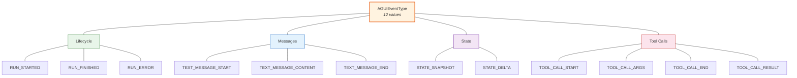
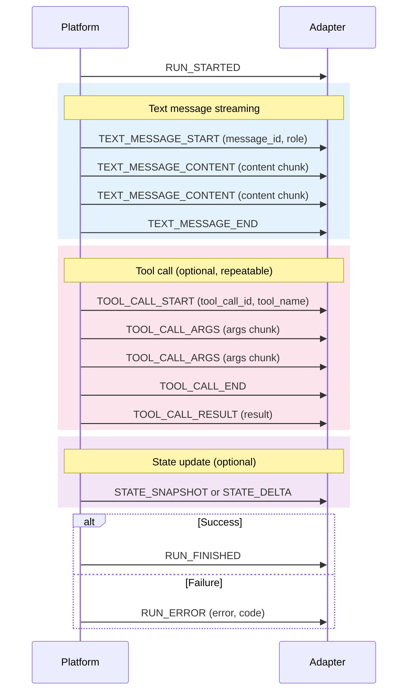

# Events -- AG-UI Shared Kernel

> Part of the [Capillary Actions SDK architecture](architecture.md). This document covers `events.py`, the Shared Kernel that every component in the system must understand.

---

## Architectural Role

`events.py` is the SDK's **Shared Kernel** -- the minimal, cross-boundary contract that all components must understand. In Herberto Graca's terms:

> "A Shared Kernel is a library with a set of application core functionality shared among all components... kept as minimal as possible."
>
> -- [Explicit Architecture](https://herbertograca.com/2017/11/16/explicit-architecture-01-ddd-hexagonal-onion-clean-cqrs-how-i-put-it-all-together/)

Events sit at the **package root** (`events.py`), not inside `models/`, because they belong to no single domain track. Every track and every adapter imports them:

- **Ports** reference event types in their method signatures (e.g., yielding `AGUIEvent` from workflow execution).
- **Reference adapters** construct and emit events to communicate with the platform.
- **Domain models** remain independent of events -- models define *what things are*, events define *what happened*.

Like `models/`, the events module has **zero dependencies beyond stdlib and pydantic**. This constraint is non-negotiable: since every component imports events, adding a dependency here would transitively pollute the entire SDK.

---

## Event Taxonomy

The AG-UI protocol defines **12 event types** organized into four categories. The `AGUIEventType` enum encodes all 12 values.



**Lifecycle** (3 events) -- bracket the entire workflow run. Every run begins with `RUN_STARTED` and ends with either `RUN_FINISHED` (success) or `RUN_ERROR` (failure).

**Messages** (3 events) -- represent streaming text output from the agent. `TEXT_MESSAGE_START` opens a message with a `message_id` and `role`, then zero or more `TEXT_MESSAGE_CONTENT` events deliver content chunks, and `TEXT_MESSAGE_END` closes it.

**State** (2 events) -- communicate workflow state changes. `STATE_SNAPSHOT` sends the full state dictionary; `STATE_DELTA` sends a list of JSON Patch-style operations.

**Tool Calls** (4 events) -- represent function/tool invocations by the agent. `TOOL_CALL_START` opens with a `tool_call_id` and `tool_name`, `TOOL_CALL_ARGS` streams argument chunks, `TOOL_CALL_END` closes the invocation, and `TOOL_CALL_RESULT` delivers the result.

---

## Event Lifecycle Sequence

A typical workflow run produces events in this order. Not all events appear in every run -- tool calls and state events are optional depending on the workflow.



Key observations:

- **`RUN_STARTED` always comes first**, `RUN_FINISHED` or `RUN_ERROR` always comes last.
- **Message blocks** (`START` / `CONTENT` / `END`) and **tool call blocks** (`START` / `ARGS` / `END` / `RESULT`) can interleave -- an agent may produce text, call a tool, then produce more text.
- **State events** can appear at any point between lifecycle bookends.
- **`TEXT_MESSAGE_CONTENT`** and **`TOOL_CALL_ARGS`** are streaming events -- they may repeat any number of times within their block.

---

## Base Class Contract

All 12 event types inherit from `AGUIEvent`, a Pydantic `BaseModel` that provides five common fields:

| Field | Type | Default | Description |
|-------|------|---------|-------------|
| `event_type` | `AGUIEventType` | *(required)* | Enum discriminator -- identifies which event this is |
| `thread_id` | `str` | *(required)* | Conversation or session identifier |
| `run_id` | `str` | *(required)* | Workflow execution identifier |
| `timestamp` | `datetime` | `datetime.now(timezone.utc)` | UTC timestamp, auto-generated via `default_factory` |
| `event_id` | `str` | `str(uuid4())` | Unique event ID, auto-generated via `default_factory` |

The base class also provides a `to_dict()` method for serialization:

```python
def to_dict(self) -> dict[str, Any]:
    return {
        "type": self.event_type.value,   # Note: "type", not "event_type"
        "thread_id": self.thread_id,
        "run_id": self.run_id,
        "timestamp": self.timestamp,
        "event_id": self.event_id,
    }
```

Note that `to_dict()` maps `event_type` to the key `"type"` using the enum's `.value` (the raw string, e.g., `"RUN_STARTED"`). Subclasses override `to_dict()` to include their additional fields via `{**super().to_dict(), ...}`.

---

## Subclass-Specific Fields

Each event subclass adds fields beyond the five base fields. Subclasses with no additional fields listed inherit only the base contract.

| Event Class | Category | Additional Fields |
|-------------|----------|-------------------|
| `RunStartedEvent` | Lifecycle | *(none)* |
| `RunFinishedEvent` | Lifecycle | *(none)* |
| `RunErrorEvent` | Lifecycle | `error: str`, `code: str \| None = None` |
| `TextMessageStartEvent` | Messages | `message_id: str`, `role: str` |
| `TextMessageContentEvent` | Messages | `message_id: str`, `content: str` |
| `TextMessageEndEvent` | Messages | `message_id: str` |
| `StateSnapshotEvent` | State | `state: dict[str, Any]` |
| `StateDeltaEvent` | State | `delta: list[dict[str, Any]]` |
| `ToolCallStartEvent` | Tool Calls | `tool_call_id: str`, `tool_name: str` |
| `ToolCallArgsEvent` | Tool Calls | `tool_call_id: str`, `args_chunk: str` |
| `ToolCallEndEvent` | Tool Calls | `tool_call_id: str` |
| `ToolCallResultEvent` | Tool Calls | `tool_call_id: str`, `result: str` |

Notice the correlation patterns:

- **All message events** share a `message_id` field to group chunks into a single logical message.
- **All tool call events** share a `tool_call_id` field to group the invocation lifecycle.
- **Only `RunErrorEvent`** carries error details -- `RUN_FINISHED` is a bare signal with no payload.
- **`code` on `RunErrorEvent`** is optional, allowing structured error categorization when available.

---

## Why Shared Kernel, Not Domain Events

The AG-UI events are frequently called "events," but they are *not* domain events in the DDD sense. The distinction matters:

**Domain Events** are facts about internal state changes within a bounded context. They are raised by aggregates and consumed by handlers *within the same context*. Example: "WorkflowCompleted" inside the platform's workflow engine. They carry domain-specific semantics and may reference internal entities.

**Application Events** are use case outcomes, defined in the application layer. They cross component boundaries within the same system. Example: "user registered" triggering a welcome email.

**Integration Events** are cross-boundary communication protocol between independent components. They exist so that systems can communicate without understanding each other's internal domain models.

AG-UI events are **integration events**. They exist so adapters can communicate with the platform without understanding its internal domain model. An adapter does not need to know about SQLAlchemy models, Temporal workflows, or Redis pub/sub -- it only needs to know that a `TextMessageContentEvent` carries a `content` chunk for a given `message_id`.

This is why events live **outside `models/`** and are imported by both `ports/` (the application boundary) and `reference/` (infrastructure). They are not part of any single domain track -- they are the universal language that *all* tracks and *all* adapters speak.

For the platform's full three-tier event taxonomy (Domain Events, Application Events, Integration Events), see the backend's [`ARCHITECTURE_PRINCIPLES.md`](https://github.com/allogy/agents_runner/blob/development/docs/ARCHITECTURE_PRINCIPLES.md) section on Event-Driven Patterns.

---

## Contributor Guardrails

Changes to `events.py` affect **every adapter** in the ecosystem. Treat any modification as a breaking change and follow these rules:

1. **Adding a new event type** requires four changes in lockstep:
   - Add a new value to the `AGUIEventType` enum.
   - Create a new subclass of `AGUIEvent` with the appropriate `event_type` default.
   - Override `to_dict()` to include any subclass-specific fields.
   - Add tests covering construction, serialization, and the enum-subclass mapping.

2. **Renaming or removing an event type** is a breaking change that requires a deprecation cycle. Existing adapters depend on the string values in `AGUIEventType`.

3. **Events must remain serializable.** The `to_dict()` method must return a JSON-safe dictionary. Do not add fields whose types cannot be serialized to JSON (e.g., file handles, database connections, callables).

4. **No infrastructure imports.** Only `stdlib` and `pydantic` are allowed. This constraint is tested -- if you import `httpx`, `sqlalchemy`, or any other library, the dependency rule is broken.

5. **The `AGUIEventType` enum must stay in sync with event subclasses.** Every enum value must have exactly one corresponding subclass, and every subclass must set its `event_type` default to the matching enum value.

6. **Naming convention:** `CATEGORY_ACTION` for enum values (e.g., `TEXT_MESSAGE_START`, `TOOL_CALL_END`), `CategoryActionEvent` for class names (e.g., `TextMessageStartEvent`, `ToolCallEndEvent`).

---

## See Also

- [Architecture Overview](architecture.md) -- how events fit into the concentric layer model
- [Ports](ports.md) -- port interfaces that yield and consume events
- [Reference Adapters](reference-adapters.md) -- concrete adapter that constructs events
- [Contributing](contributing.md) -- dependency rule enforcement and testing patterns
