# Ports -- The Application Boundary

> Part of the [Capillary Actions SDK Architecture](architecture.md).

The `ports/` package defines every contract between the platform core and external adapters. This document explains how ports are organized, which ones extension developers implement, and the conventions that keep the boundary clean.

---

## 1. Architectural Role

In Explicit Architecture, ports sit at the **Application Boundary** -- the ring that separates the domain core from all infrastructure and external tooling.

As Herberto Graca puts it:

> "A port is the specification of how the tool can use the application core, or how it is used by the Application Core."

In the Capillary Actions SDK this translates to a set of Python ABCs that carry two guarantees:

1. **Ports import inward only.** They depend on `models/` and `events.py` but never on `reference/` or any infrastructure package.
2. **Ports are shaped by the application, not the tools.** A `ChannelAdapterPort` describes what the platform needs from a messaging channel -- not what Slack's API happens to offer. Adapter authors map their tool's API onto the port's shape, not the other way around.

Because the SDK is a contract library (no runtime), ports are the primary artifact that consumers interact with. Every adapter is an implementation of one or more port ABCs.

---

## 2. Inbound vs Outbound Taxonomy

Ports fall into two categories following the Hexagonal Architecture convention:

| Direction | Also Called | Who Implements | Who Invokes |
|-----------|-------------|----------------|-------------|
| **Inbound** | Driving / Primary | The platform runtime | Adapters and extension code |
| **Outbound** | Driven / Secondary | Extension developers | The platform runtime |

The following diagram shows how both categories form the hexagonal boundary of the SDK:

```mermaid
graph LR
    subgraph driving["Driving / Inbound Ports"]
        direction TB
        P1["RunWorkflowPort"]
        P2["ResumeWorkflowPort"]
        P3["EventStreamPort"]
        P4["StateManagerPort"]
        P5["IngestSignalPort"]
        P6["QueryCohortPort"]
        P7["ManageCohortPort"]
        P8["RegisterTriggerPort"]
        P9["RunOrchestratorPort"]
        P10["RunAgentLoopPort"]
    end

    subgraph core["Application Core"]
        direction TB
        M["models/"]
        E["events.py"]
    end

    subgraph driven["Driven / Outbound Ports"]
        direction TB
        O1["CohortStrategyPort"]
        O2["SignalStorePort"]
        O3["CohortStorePort"]
        O4["TriggerSchedulerPort"]
        O5["WorkflowInvokerPort"]
        O6["LoopStatePort"]
        O7["OrchestrationStatePort"]
        O8["KnowledgeGraphPort"]
        O9["LearnerProgressPort"]
        O10["TeachingPort"]
        O11["ChannelAdapterPort"]
        O12["ChannelSessionStorePort"]
    end

    driving -->|"use"| core
    core -->|"define"| driven
```



**Left side (Driving/Inbound):** The platform provides concrete implementations of these ports. They represent capabilities the platform already has -- starting workflows, managing state, ingesting signals, running orchestrations. Adapters and extension code call them.

**Right side (Driven/Outbound):** The SDK defines these as abstract contracts. Extension developers implement them to plug in their own storage backends, scheduling engines, messaging channels, knowledge graphs, and clustering strategies.

---

## 3. Port File Organization

| File | Port | Direction | Track |
|------|------|-----------|-------|
| `platform.py` | `RunWorkflowPort` | Inbound | Platform |
| `platform.py` | `ResumeWorkflowPort` | Inbound | Platform |
| `platform.py` | `EventStreamPort` | Inbound | Platform |
| `platform.py` | `StateManagerPort` | Inbound | Platform |
| `student_model.py` | `IngestSignalPort` | Inbound | Student Model |
| `student_model.py` | `QueryCohortPort` | Inbound | Student Model |
| `student_model.py` | `ManageCohortPort` | Inbound | Student Model |
| `student_model.py` | `CohortStrategyPort` | Outbound | Student Model |
| `student_model.py` | `SignalStorePort` | Outbound | Student Model |
| `student_model.py` | `CohortStorePort` | Outbound | Student Model |
| `learning_actions.py` | `RegisterTriggerPort` | Inbound | Learning Actions |
| `learning_actions.py` | `RunOrchestratorPort` | Inbound | Learning Actions |
| `learning_actions.py` | `RunAgentLoopPort` | Inbound | Learning Actions |
| `learning_actions.py` | `TriggerSchedulerPort` | Outbound | Learning Actions |
| `learning_actions.py` | `WorkflowInvokerPort` | Outbound | Learning Actions |
| `learning_actions.py` | `LoopStatePort` | Outbound | Learning Actions |
| `learning_actions.py` | `OrchestrationStatePort` | Outbound | Learning Actions |
| `learner_interaction.py` | `KnowledgeGraphPort` | Outbound | Learner Interaction |
| `learner_interaction.py` | `LearnerProgressPort` | Outbound | Learner Interaction |
| `learner_interaction.py` | `TeachingPort` | Outbound | Learner Interaction |
| `presentation.py` | `ChannelAdapterPort` | Outbound | Presentation |
| `presentation.py` | `ChannelSessionStorePort` | Outbound | Presentation |

All 22 ports are re-exported from `ports/__init__.py` alongside the 4 platform DTOs.

---

## 4. Main Extension Points

Most contributors will implement one of four outbound port families. Each represents a concrete integration point where external tools meet the platform.

### CohortStrategyPort -- Plug in a clustering algorithm

Implement this port to control how learners are grouped into cohorts. A strategy decides cohort assignment, evolution, and reorganization.

| Method | Purpose |
|--------|---------|
| `strategy_type` (property) | Returns the strategy identifier (e.g. `'similarity'`, `'kmeans'`) |
| `assign(user_id, signals)` | Assign a user to cohorts based on their preference signals |
| `evolve(cohort_id, new_signals)` | Update a cohort's aggregate state with new signals |
| `should_reorganize(cohort_id)` | Determine whether the cohort needs a full reorganization |
| `reorganize(org_id)` | Perform a full reorganization of all cohorts in an organization |

### TriggerSchedulerPort -- Plug in a scheduling engine

Implement this port to bridge an external scheduler (cron, event bus, webhook listener) to the platform's trigger system.

| Method | Purpose |
|--------|---------|
| `schedule(trigger)` | Schedule a trigger and return an opaque handle string |
| `cancel(handle)` | Cancel a scheduled trigger by its handle |
| `list_active()` | List all currently active scheduled triggers |
| `register_webhook_handler(path, callback)` | Register a callback for an inbound webhook path |

### ChannelAdapterPort -- Bridge a messaging platform

Implement this port to connect a messaging channel (Slack, Telegram, Teams, etc.) to the platform. The adapter handles both outbound delivery and inbound parsing.

| Method | Purpose |
|--------|---------|
| `channel_type` (property) | Short identifier for the channel (e.g. `'slack'`, `'teams'`) |
| `send_event(event, session)` | Forward an AG-UI event to the channel |
| `send_error(error, session)` | Deliver an error message to the channel |
| `render_hitl_gate(gate_type, gate_config, session)` | Render a human-in-the-loop gate prompt |
| `receive_message(raw_payload)` | Parse an inbound message from the channel |
| `receive_file(raw_payload)` | Parse an inbound file upload, if present |
| `resolve_session(raw_payload)` | Identify or create the channel session from an inbound payload |
| `register_webhook(callback_url)` | Register the webhook endpoint with the channel platform |
| `health_check()` | Verify the channel integration is reachable |

### Learner Interaction trio -- Connect a knowledge graph and progress tracker

Three ports work together to support teaching interactions that combine knowledge graph structure with learner progress data.

**KnowledgeGraphPort** -- query and search concepts:

| Method | Purpose |
|--------|---------|
| `get_graph(graph_id)` | Retrieve a Knowledge Graph by ID |
| `get_concept(concept_id)` | Retrieve a single concept by its slug |
| `get_prerequisites(concept_id)` | Return all prerequisite concepts |
| `search_concepts(query, graph_id)` | Search for concepts matching a text query |

**LearnerProgressPort** -- track mastery state:

| Method | Purpose |
|--------|---------|
| `get_progress(learner_id, graph_id)` | Retrieve a learner's progress within a graph |
| `update_mastery(learner_id, concept_id, score)` | Update mastery score (0.0 to 1.0) for a concept |
| `get_next_concept(learner_id, graph_id)` | Determine the next concept a learner should study |

**TeachingPort** -- assemble context and record outcomes:

| Method | Purpose |
|--------|---------|
| `build_context(learner_id, concept_id)` | Assemble teaching context combining progress, concept, and student model data |
| `record_outcome(learner_id, concept_id, outcome)` | Record the outcome of a teaching interaction |

---

## 5. Platform Ports and DTOs

The four ports in `platform.py` are **inbound** -- the platform provides concrete implementations and injects them at runtime. Extension developers call these ports but never implement them.

### DTOs

Platform ports use dedicated request/response objects rather than loose parameter lists:

| DTO | Fields | Used By |
|-----|--------|---------|
| `RunWorkflowRequest` | `workflow_id: UUID`, `thread_id: str`, `input_data: dict \| None`, `org_id: UUID \| None` | `RunWorkflowPort` |
| `RunWorkflowResponse` | `run_id: str`, `output: dict`, `status: str` | `RunWorkflowPort.run_sync` |
| `ResumeWorkflowRequest` | `workflow_run_id: UUID`, `thread_id: str`, `decision: str \| None`, `input_data: dict \| None`, `comment: str \| None` | `ResumeWorkflowPort` |
| `ResumeWorkflowResponse` | `run_id: str`, `status: str` | `ResumeWorkflowPort.resume_sync`, `ResumeWorkflowPort.reject` |

### RunWorkflowPort

Start new workflow runs. Two execution modes:

- `run(request) -> AsyncIterator[AGUIEvent]` -- stream AG-UI events as they are produced
- `run_sync(request) -> RunWorkflowResponse` -- wait for completion, return the final result

### ResumeWorkflowPort

Resume or reject paused (human-in-the-loop) workflow runs:

- `resume(request) -> AsyncIterator[AGUIEvent]` -- resume and stream events
- `resume_sync(request) -> ResumeWorkflowResponse` -- resume and wait for completion
- `reject(request) -> ResumeWorkflowResponse` -- reject the paused workflow

### EventStreamPort

Serialize and forward AG-UI events to downstream consumers:

- `stream_events(events) -> AsyncIterator[str]` -- serialize a stream of events to SSE strings
- `send_event(event) -> str` -- serialize a single event to an SSE string
- `send_error(error, thread_id, run_id) -> str` -- serialize an error as an SSE error event

### StateManagerPort

Read and mutate per-thread workflow state:

- `get_state(thread_id) -> dict[str, Any]` -- retrieve the current state snapshot
- `update_state(thread_id, state) -> None` -- replace the state with a new snapshot
- `apply_delta(thread_id, delta) -> None` -- apply a JSON Patch delta (RFC 6902)

These four DTOs and four ports are re-exported from `ports/__init__.py` alongside all track-specific ports.

---

## 6. Method Patterns

All port methods are `async`. Two patterns appear across the SDK:

### Request/Response

The majority of methods follow the standard async request/response pattern:

```python
@abstractmethod
async def get_state(self, thread_id: str) -> dict[str, Any]:
    ...
```

The caller `await`s the result and receives a concrete return value (`dict`, a domain model, `None`, etc.).

### Streaming

Methods that produce a sequence of events return an `AsyncIterator`:

```python
@abstractmethod
async def run(self, request: RunWorkflowRequest) -> AsyncIterator[AGUIEvent]:
    ...
```

Streaming appears in:

- `RunWorkflowPort.run` -- streams `AGUIEvent`
- `ResumeWorkflowPort.resume` -- streams `AGUIEvent`
- `EventStreamPort.stream_events` -- streams SSE-formatted `str`
- `RunOrchestratorPort.run` -- streams `OrchestrationEvent`
- `RunAgentLoopPort.run` -- streams `LoopEvent`
- `WorkflowInvokerPort.invoke_streaming` -- streams `AGUIEvent`

Callers consume these with `async for`:

```python
async for event in run_port.run(request):
    handle(event)
```

---

## 7. Contributor Guardrails

Follow these rules when adding or modifying ports:

1. **Ports must be ABCs with all methods marked `@abstractmethod`.** This ensures adapters get clear errors at instantiation time if they forget to implement a method.

2. **Port method signatures use only SDK models and stdlib types.** Parameters and return types must come from `capillary_actions_sdk.models`, `capillary_actions_sdk.events`, or the Python standard library (`UUID`, `str`, `dict`, `list`, `datetime`, `Any`, etc.). Never reference framework types, ORM models, or infrastructure classes.

3. **Inbound ports = "what can the platform do?"** They expose capabilities the platform already provides. **Outbound ports = "what does the platform need?"** They describe capabilities the platform requires from external tools.

4. **New ports must be re-exported in `ports/__init__.py`.** Use the established grouping: Platform, Track 1 (Student Model), Track 2 (Learning Actions, Learner Interaction), Track 3 (Presentation). Include both inbound and outbound ports in the `__all__` list.

5. **Port naming convention: `<Action><Domain>Port`.** Examples: `IngestSignalPort`, `RunOrchestratorPort`, `QueryCohortPort`. The action verb comes first, followed by the domain noun, followed by `Port`.

6. **Platform ports (`platform.py`) are the SDK's most stable contract.** Changes to platform port signatures require a major version bump. Track-specific ports follow semver normally but still require careful consideration since adapters depend on them.

7. **Properties use `@property` + `@abstractmethod` together.** See `CohortStrategyPort.strategy_type` and `ChannelAdapterPort.channel_type` for examples.

8. **Streaming methods return `AsyncIterator`, not `AsyncGenerator`.** Import from `collections.abc`, not `typing`.

---

## See Also

- [architecture.md](architecture.md) -- concentric layer model and overall SDK structure
- [domain-models.md](domain-models.md) -- the Pydantic models that port signatures reference
- [events.md](events.md) -- the AG-UI event protocol (Shared Kernel)
- [reference-adapters.md](reference-adapters.md) -- concrete implementations of outbound ports
- [contributing.md](contributing.md) -- development workflow and contribution guidelines
