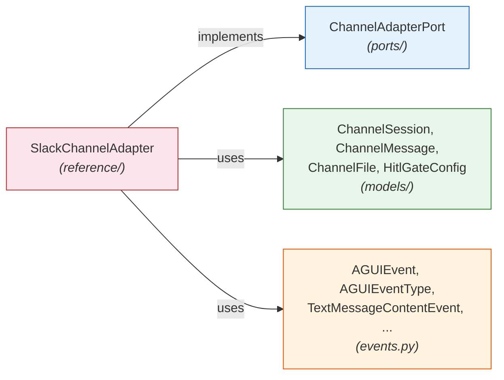

# Reference Adapters -- The Infrastructure Layer

> Part of the [Capillary Actions SDK Architecture](architecture.md). This document covers `reference/`, the outermost ring of the Explicit Architecture.

---

The `reference/` directory contains **concrete adapter implementations** -- the infrastructure layer in Explicit Architecture terms. These are working examples of outbound (driven/secondary) adapters that demonstrate how to implement port interfaces against a real-world platform.

Reference adapters serve two purposes:

1. **Teaching tool** -- dissect one to understand the adapter pattern before building your own
2. **Test fixture** -- use in-memory adapters in integration tests without external service dependencies

## Architectural Role

In the [concentric layer model](architecture.md), reference adapters sit in the **outermost ring**. They are the only SDK code that depends on everything else:



The dependency arrows only point **inward** -- toward ports, models, and events. No other SDK code imports from `reference/`. This means reference adapters can be added, modified, or removed without affecting the rest of the SDK.

## SlackChannelAdapter Dissected

The SDK ships with one reference adapter: `SlackChannelAdapter`, which implements `ChannelAdapterPort` for Slack.

### Constructor

```python
def __init__(self, bot_token: str, signing_secret: str) -> None
```

Accepts Slack credentials and initializes two internal data structures:

- `_message_buffer: dict[str, list[str]]` -- accumulates streaming tokens per session
- `_outbox: list[dict[str, Any]]` -- captures outbound messages in-memory (instead of calling the Slack API)

### Method-by-Method Walkthrough

#### `channel_type` (property)

Returns `"slack"`. Every `ChannelAdapterPort` implementation must return a unique string identifying the channel platform.

#### `send_event(event, session)`

The core method -- routes each AG-UI event type to the appropriate Slack representation:

| Event Type | Behavior |
|-----------|----------|
| `TEXT_MESSAGE_START` | Initializes an empty token buffer for the session |
| `TEXT_MESSAGE_CONTENT` | Appends the content chunk to the buffer |
| `TEXT_MESSAGE_END` | Flushes the buffer, joins all tokens, appends complete message to outbox |
| `STATE_SNAPSHOT` | Renders state as Block Kit `section` fields (`*key*\nvalue`) |
| `RUN_FINISHED` | Appends "Run completed." message |
| `RUN_ERROR` | Delegates to `send_error()` |

Events not listed above are silently ignored -- the adapter only handles what's relevant to Slack.

#### `send_error(error, session)`

Formats the error with a Slack `:x:` emoji prefix and appends to the outbox.

#### `render_hitl_gate(gate_type, gate_config, session)`

Renders human-in-the-loop gates as Slack-native UI:

- **`"human_review"` gate** -- Renders Block Kit buttons (one per option from `gate_config.options`), with a section header from `gate_config.instructions`
- **Other gates** -- Falls back to a plain text prompt

#### `receive_message(raw_payload)`

Parses inbound Slack webhook payloads into a `ChannelMessage`:

| Payload Shape | Detected As | `message_type` |
|--------------|-------------|----------------|
| `payload.type == "block_actions"` | Button click | `"hitl_decision"` |
| `event.text` starts with `/` | Slash command | `"command"` |
| Everything else | Regular message | `"text_input"` |

Each message gets a fresh `uuid4()` ID and carries the original `raw_payload` for debugging.

#### `receive_file(raw_payload)`

Extracts the first file from `event.files[]` in a Slack event payload. Returns `None` if no files are present. Extracts filename, MIME type, size, and `url_private`. The `content` field is left empty (`b""`) since the reference adapter doesn't make real HTTP calls to download file bytes.

#### `resolve_session(raw_payload)`

Creates a `ChannelSession` from the inbound payload, handling two Slack payload structures:

- **`block_actions`** -- Extracts `user.id` and `channel.id` from the nested payload
- **`event_callback`** -- Extracts `user` and `channel` from the event object

#### `register_webhook(callback_url)`

No-op. Slack webhook registration is handled externally (via the Slack App configuration dashboard), not programmatically by the adapter.

#### `health_check()`

Returns `bool(self._bot_token)` -- a simple credential-presence check.

## Key Design Decisions

### Token Buffering

AG-UI streams text one token at a time (`TEXT_MESSAGE_CONTENT` events). But Slack's API expects complete messages. The adapter bridges this mismatch by buffering tokens in `_message_buffer` and flushing the joined text on `TEXT_MESSAGE_END`.

This is a pattern you'll likely need in any channel adapter -- most messaging APIs don't support token-level streaming.

### In-Memory Outbox

Instead of making real HTTP calls to the Slack API, the adapter captures all outbound messages in `_outbox`. This makes it:

- **Testable** without network access or API credentials
- **Inspectable** -- tests can assert on the exact messages that would have been sent
- **Zero-dependency** -- no `slack_sdk` or `httpx` import needed

A production adapter would replace `_outbox.append(...)` with actual API calls (e.g., `slack_sdk.WebClient.chat_postMessage()`).

### Payload Normalization

Slack sends different JSON structures for different event types (`block_actions` vs `event_callback`). The adapter normalizes both into the same SDK models (`ChannelMessage`, `ChannelSession`), hiding Slack-specific complexity from the rest of the system.

## Building Your Own Adapter

Follow this pattern to implement any outbound port:

### Step 1: Choose Your Port

The main extension ports for adapter developers:

| Port | Domain | You're Building |
|------|--------|----------------|
| `ChannelAdapterPort` | Presentation | A messaging platform bridge (Telegram, Teams, Discord, ...) |
| `CohortStrategyPort` | Student Model | A clustering algorithm (k-means, similarity, ...) |
| `TriggerSchedulerPort` | Learning Actions | A scheduling engine (cron, event bus, ...) |
| `KnowledgeGraphPort` | Learner Interaction | A knowledge graph backend |

### Step 2: Subclass the Port ABC

```python
from capillary_actions_sdk.ports.presentation import ChannelAdapterPort

class TelegramAdapter(ChannelAdapterPort):
    @property
    def channel_type(self) -> str:
        return "telegram"
```

### Step 3: Implement All Abstract Methods

Your IDE will flag every unimplemented method. Each one has a clear signature — use only SDK types (models + events) in the interface, wrap your platform's SDK internally.

### Step 4: Handle Token Buffering (Channel Adapters)

If you're implementing `ChannelAdapterPort`, you'll need the same buffering pattern as the Slack adapter — accumulate `TEXT_MESSAGE_CONTENT` events and flush on `TEXT_MESSAGE_END`.

### Step 5: Write Tests

Follow the pattern in `tests/test_reference_slack.py`:

1. **Port compliance** -- `assert isinstance(adapter, ChannelAdapterPort)`
2. **Token buffering** -- Send START → CONTENT → CONTENT → END, verify the joined output
3. **Inbound parsing** -- Feed raw payloads, verify the resulting `ChannelMessage.message_type`
4. **Session resolution** -- Verify correct extraction of user/channel IDs

### Step 6: Decide Where It Lives

- **Reference adapter** (in `reference/`) -- for testing/demo purposes, no external dependencies, in-memory state
- **External package** -- for production adapters with real API clients and dependencies

## Contributor Guardrails

- Reference adapters must implement a port ABC -- no standalone classes
- Keep zero external dependencies beyond pydantic (no `slack_sdk`, `httpx`, etc.)
- Use in-memory state (lists, dicts) instead of real external services
- New reference adapters must be exported in `reference/__init__.py`
- Reference code prioritizes clarity over cleverness -- it's a teaching tool
- Test files go in `tests/test_reference_<name>.py` and must verify both port compliance and adapter behavior

## See Also

- [Architecture](architecture.md) -- where the infrastructure layer fits in the concentric model
- [Ports](ports.md) -- the contracts that reference adapters implement
- [Events](events.md) -- the AG-UI protocol that adapters consume and produce
- [Contributing](contributing.md) -- checklists for adding new reference adapters
